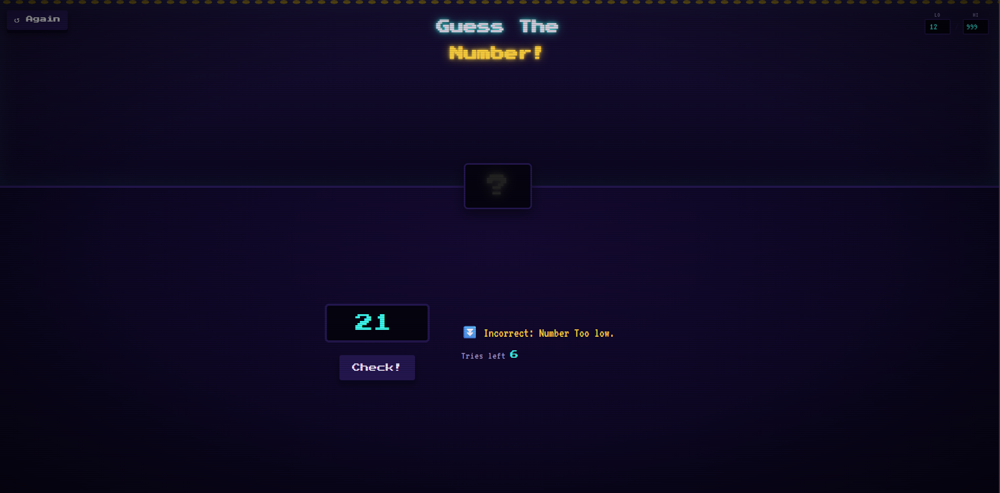
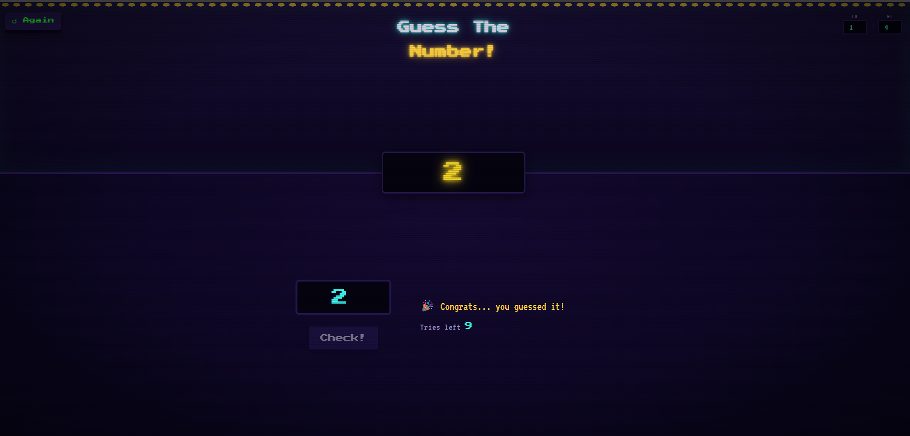

# 🎮 Guess The Number (literally)!

A retro arcade-style number guessing game built with HTML, CSS, and JavaScript — no frameworks, no dependencies. Pick a range, take your guesses, and try to crack the number before you run out of tries.



## How to play

1. Set a custom range using the **LO** / **HI** fields (defaults to 1–20).
2. Enter a guess and hit **Check!**
3. The message panel tells you if you're too high, too low, or spot on.
4. You've got 10 tries per round — run out and the number is revealed (You can edit the `maxTries` in script.js to reduce the tries).
5. Hit **↺ Again** to start a fresh round at any time.



## Features

- Custom guessing range
- Live tries counter
- Win / lose background color feedback
- Fully responsive, mobile-friendly layout
- Retro arcade-cabinet UI — CRT scanline overlay, glowing LED-style number display, pixel-bevel buttons

## Project structure

```
guess-my-number/
├── index.html      # markup
├── style.css        # arcade-cabinet styling
├── script.js         # game logic
└── assets/           # screenshots
```

## Getting started

Simply download the code and open the html file in your browser.

Note: Apologies in advance for the messy code, this is my first web dev project...

## License

MIT — feel free to fork and remix.
